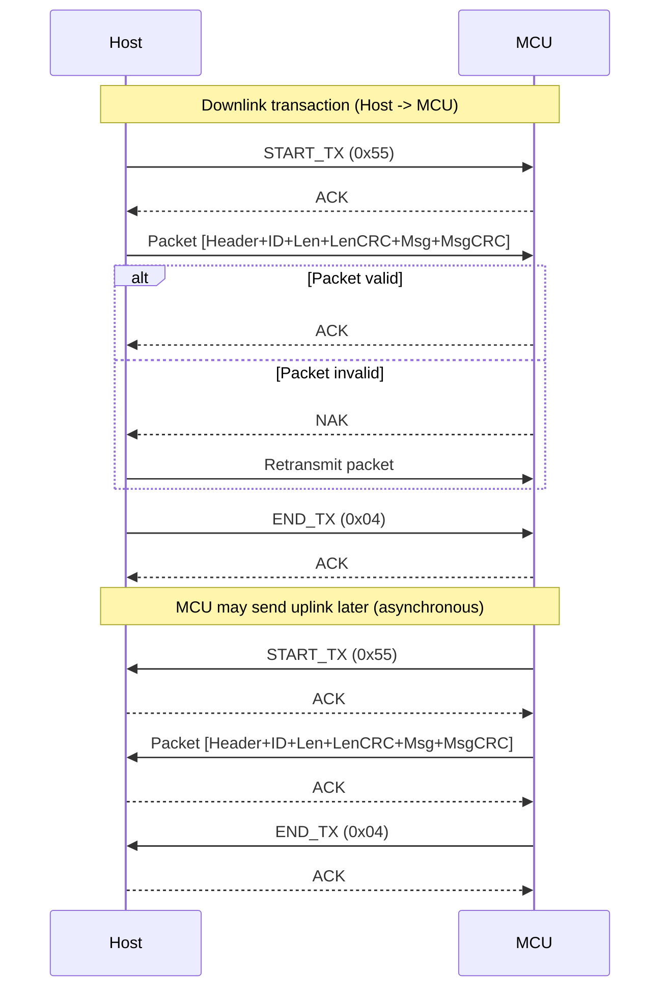
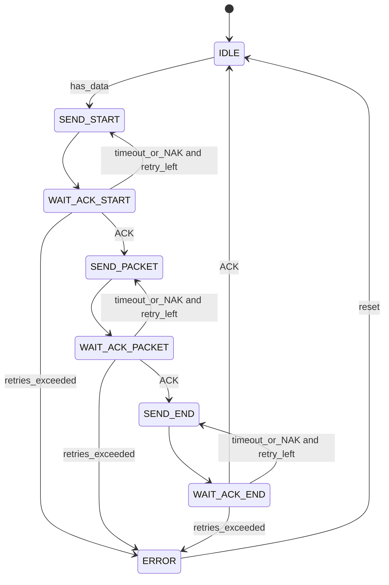
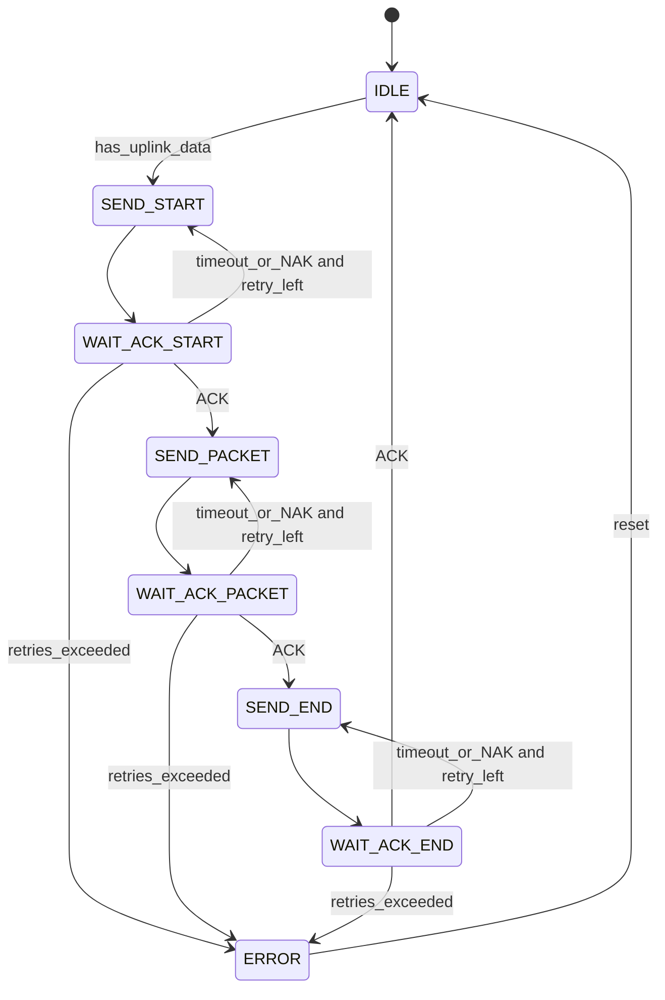
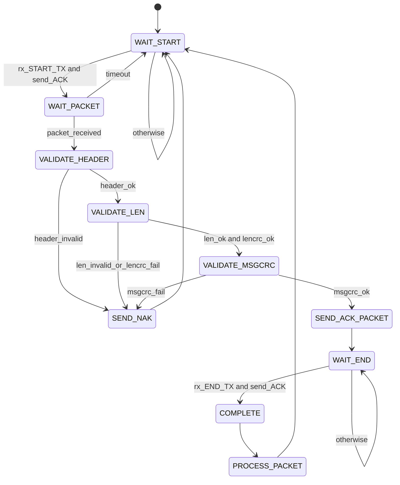

# UART TRANSACTION PROTOCOL SPECIFICATION (HOST <-> MCU)

## 0. Overview

This document defines a reliable UART transaction protocol where each direction uses the same 3-step flow:
1. Start transaction
2. Send one packet and get ACK
3. End transaction

The MCU does not need to reply with payload immediately after receiving a Host packet.
When MCU wants to send data to Host, MCU starts a new transaction by itself using the same flow.

## 1. General Configuration

### 1.1 UART Link
- Direction: Full-duplex (Host <-> MCU)
- Recommended UART: `115200`, `8N1`, no flow control

### 1.2 Control Bytes
- `START_TX`: `0x55`
- `ACK`: `0x06`
- `NAK`: `0x15` (optional, but recommended)
- `END_TX`: `0x04` (EOT)

### 1.3 Reliability Rules
- Sender MUST wait ACK after each control/data step.
- On timeout or NAK, sender retries the same step.
- Recommended retry limit: `3..5` times.
- Recommended ACK timeout: `50..200 ms`.

## 2. Packet Structure

### 2.1 Binary Layout

`[Header(1)][PacketID(1)][Length(2)][LenCRC(1)][Message(N)][MsgCRC(1)]`

| Field | Size | Description |
|---|---:|---|
| Header | 1 byte | Fixed header byte (`0x02`) |
| PacketID | 1 byte | Packet sequence ID (`0x00..0xFF`) |
| Length | 2 bytes | Message length in bytes (`0..512`) |
| LenCRC | 1 byte | CRC-8 of the 2-byte Length field |
| Message | N bytes | Payload data (`N <= 512`) |
| MsgCRC | 1 byte | CRC-8 of `PacketID + Length + LenCRC + Message` |

### 2.2 Length Encoding
- `Length` is 2 bytes, little-endian (`LEN_L`, `LEN_H`).
- Valid range: `0..512`.

### 2.3 CRC Definitions
- `LenCRC`: CRC-8 over the two Length bytes.
- `MsgCRC`: CRC-8 over `PacketID + Length(2) + LenCRC + Message(N)`.

If your project already uses another CRC polynomial, both Host and MCU MUST use exactly the same algorithm/seed.

## 3. Handshake Process

### 3.1 Downlink Transaction (Host -> MCU)
1. Host sends `START_TX (0x55)`.
2. MCU returns `ACK`.
3. Host sends one full packet.
4. MCU validates packet and returns `ACK` (or `NAK` if invalid).
5. Host sends `END_TX (0x04)`.
6. MCU returns `ACK`.
7. MCU processes the packet data in its application flow.

### 3.2 Uplink Transaction (MCU -> Host)
When MCU wants to publish data, MCU starts a new transaction independently:
1. MCU sends `START_TX (0x55)`.
2. Host returns `ACK`.
3. MCU sends one full packet.
4. Host validates packet and returns `ACK` (or `NAK`).
5. MCU sends `END_TX (0x04)`.
6. Host returns `ACK`.

This can happen at any time and does not require immediate response payload after downlink.

## 4. Error Handling and Retry Rules

1. Sender MUST wait for ACK after each step: `START_TX`, `Packet`, `END_TX`.
2. If sender receives `NAK`, sender MUST retransmit the same step.
3. If ACK timeout occurs, sender MUST retransmit the same step.
4. If retry count exceeds limit, sender MUST abort the current transaction and reset TX FSM to `IDLE`.
5. Receiver MUST reject packet when one of the following is true:
    - Header invalid
    - `Length > 512`
    - `LenCRC` invalid
    - `MsgCRC` invalid
6. After sending `NAK`, receiver SHOULD reset RX FSM to `WAIT_START`.

## 5. Sequence Diagram

## 6. FSM (State Machines)

### 6.1 Host TX FSM (Downlink Sender)

### 6.2 MCU TX FSM (Uplink Sender)

### 6.3 MCU RX FSM (Downlink Receiver)

### 6.4 Host RX FSM (Uplink Receiver)

## 7. Packet Example (Downlink)

- Header: `02`
- PacketID: `01`
- Length: `03 00` (3 bytes)
- LenCRC: CRC-8 over `03 00`
- Message: `11 22 33`
- MsgCRC: CRC-8 over `01 03 00 LenCRC 11 22 33`

## 8. Implementation Notes

- Keep TX and RX state machines independent on both Host and MCU.
- MCU should ACK quickly, then process payload after `END_TX`.
- Reject packets with `Length > 512`.
- Reset RX FSM to `WAIT_START` on malformed data or timeout.